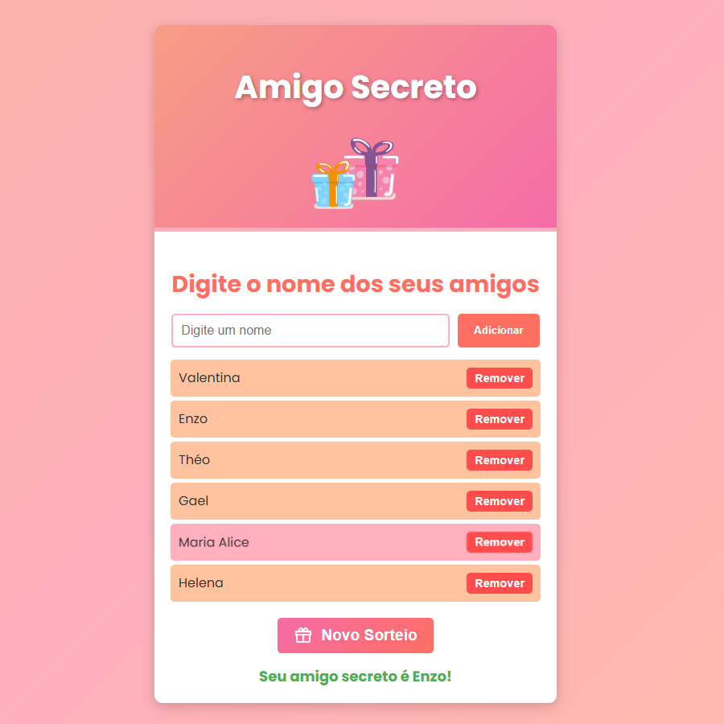

# ONE - Amigo Secreto Challenge

## Sobre o Desafio
Este projeto é uma aplicação para sorteios de amigo secreto, desenvolvida como parte do curso **Iniciante em Programação - Turma G8**, do programa Oracle Next Education (ONE). A aplicação permite adicionar nomes a uma lista e realizar sorteios aleatórios para determinar o "amigo secreto".

### Deploy
Você pode acessar o projeto através deste link: [Acessar o projeto](https://one-amigo-secreto-challenge.vercel.app/)

## Funcionalidades
- **Adicionar nomes**: Permite inserir nomes na lista de participantes.
- **Visualizar a lista**: Exibe os nomes já adicionados.
- **Remover nomes**: Possibilita excluir participantes da lista.
- **Sorteio aleatório**: Sorteia um nome de forma aleatória.
- **Novo sorteio**: Reseta a lista e permite realizar outro sorteio.
- **Validações**:
	- Garante que o campo de entrada não esteja vazio.
	- Exige pelo menos três nomes na lista antes de realizar o sorteio.
 	- Verifica se o nome inserido já foi adicionado à lista, independentemente de letras maiúsculas ou minúsculas.
  	- Impede a adição de nomes inválidos, como aqueles contendo números ou caracteres especiais.

## Tecnologias Utilizadas
- **HTML**: Estrutura da aplicação.
- **CSS**: Estilização da interface.
- **JavaScript**: Lógica de programação.

## Exemplo de uso

## Contribuições 
Contribuições são sempre bem-vindas! Se você tem sugestões de melhorias, encontrou algum bug ou simplesmente quer dizer "olá 👋🏽", sinta-se à vontade para abrir uma issue ou enviar um pull request.
